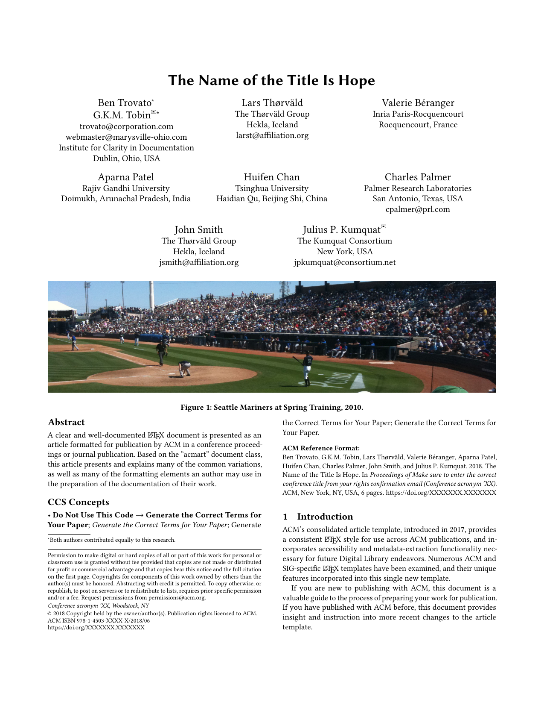

# acmart

Template for ACM journals and proceedings, using [acmart.cls](https://github.com/borisveytsman/acmart).



See [ACM Submission Guidelines](https://www.acm.org/publications/proceedings-template).

## Usage

Use this template with [MyST Markdown](https://mystmd.org):

```yaml
---
title: Your Article Title
exports:
  - format: pdf+tex
    template: ../path/to/acmart
    acm_format: sigconf
    conference_name: ACM Conference
    conference_date: June 2026
    conference_venue: New York, NY, USA
---
```

```bash
myst build your-document.md
```

## Template Options

The most important option is `acm_format`, which selects the ACM template style:

- `manuscript`, `acmsmall`, `acmlarge`, `acmtog`, `acmcp` — journal formats
- `sigconf`, `siggraph`, `sigplan`, `sigchi`, `sigchi-a`, `acmengage` — proceedings formats

### Document class options

- `screen` — colored hyperlinks (default: `false`)
- `review` — review mode with line numbers and folios (default: `false`)
- `anonymous` — anonymize for double-anonymous review (default: `false`)
- `authorversion` — produce an author-version (default: `false`)
- `nonacm` — disable ACM reference format and copyright (default: `false`)
- `balance` — balance the last two columns (default: `true`)
- `pbalance` — permanently balance columns on the last page (default: `false`)
- `natbib` — use natbib for citations (default: `true`)
- `timestamp` — add a timestamp to each page (default: `false`)
- `authordraft` — enable author draft mode (default: `false`)
- `urlbreakonhyphens` — allow URLs to break on hyphens (default: `true`)
- `acmthm` — define theorem-like environments (default: `true`)
- `font_size` — font size, one of `8pt` to `12pt`
- `language` — main document language (e.g. `english`, `french`, `german`)
- `draft` — pass draft option to amsart (default: `false`)

### Citation and copyright

- `citation_style` — `acmnumeric` (default) or `acmauthoryear`
- `copyright_mode` — copyright mode, e.g. `acmlicensed`, `acmcopyright`, `rightsretained`, `cc`, `usgov`, etc.
- `cc_type` — Creative Commons license type when `copyright_mode` is `cc` (e.g. `by`, `by-nc`, `by-sa`)
- `cc_version` — CC license version (default: `4.0`)
- `copyright_year` — copyright year

### Journal metadata

For journal formats (`acmsmall`, `acmlarge`, `acmtog`, `acmcp`):

- `acm_journal` — ACM journal code
- `acm_volume`, `acm_number`, `acm_article`, `acm_month`, `acm_year`
- `acm_doi` — publication DOI
- `acm_article_type` — article type for acmcp/JDS: `Research`, `Review`, `Discussion`, `Invited`, `Position`
- `received_date`, `revised_date`, `accepted_date` — publication history dates

### Proceedings metadata

For proceedings formats (`sigconf`, `sigplan`, `acmengage`, etc.):

- `conference_name`, `conference_short_name`, `conference_date`, `conference_venue`
- `acm_booktitle` — override proceedings booktitle
- `acm_isbn` — conference ISBN

### Topmatter configuration

- `printccs` — print CCS concepts (default: `true`)
- `printacmref` — print ACM reference format (default: `true`)
- `printfolios` — print page numbers (default depends on format)
- `authorsperrow` — number of authors per row (`0` for automatic layout)

### Other options

- `submission_id` — ACM submission ID
- `short_authors` — shortened author list for page headers (use `\and` to separate)
- `title_notes` — footnote text for the title
- `subtitle_notes` — footnote text for the subtitle
- `badge_image`, `badge_url` — artifact evaluation badge
- `code_links`, `data_links` — code/data repository URLs (acmcp/JDS)
- `acm_contributions` — author contributions statement (acmcp/JDS)

See `template.yml` for the complete list of options and their descriptions.

## Document Frontmatter

In addition to standard MyST fields (`title`, `subtitle`, `short_title`, `authors`, `affiliations`, `keywords`, `bibliography`), this template supports:

- `editors` — list of editor names for the volume or proceedings

Authors support the following fields:

- `name` (required) — full author name
- `email` — email address
- `orcid` — ORCID identifier
- `corresponding` — mark as corresponding author (boolean)
- `note` — author footnote via `\authornote`
- `authornotemark` — reference a shared author footnote by number
- `additional_affiliations` — additional affiliations rendered via `\additionalaffiliation` (same fields as a regular affiliation)

Affiliations support the following fields:

- `name` or `institution` — institution name (required)
- `position` — author's position (e.g. "Professor")
- `department` — department name
- `city`, `state`, `country` — location; `city` and `country` are required by ACM

## Document Parts

- `abstract` — the article abstract (required)
- `ccs` — ACM CCS concepts as a raw LaTeX block including `CCSXML` and `\ccsdesc` commands
- `teaser` — teaser figure content
- `acknowledgments` — acknowledgments rendered in the `acks` environment
- `appendix` — material after `\appendix`

## Files

- `template.tex` — the jtex template
- `template.yml` — template definition and option schema
- `acmart.cls` — the ACM document class (v2.18, 2026-05-31)
- `ACM-Reference-Format.bst` — ACM bibliography style
- `acm-jdslogo.png` — ACM logo image

## Example

See the `example/` directory for a sample MyST Markdown document demonstrating tables, figures, equations, code listings, and more.

## Development

Install [jtex](https://mystmd.org/jtex) and validate the template:

```bash
npm install -g jtex
jtex check
```

To auto-fix detected packages and other metadata:

```bash
jtex check --fix
```

---

Built with Kimi K2.7 Code and DeepSeek V4 Pro.
